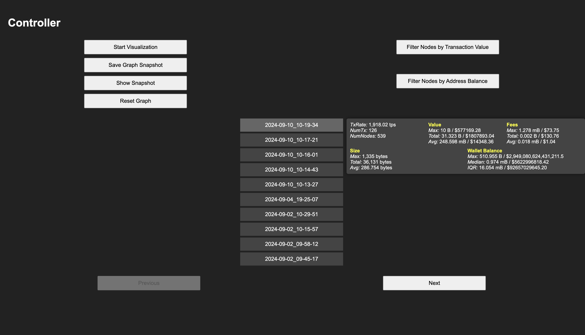
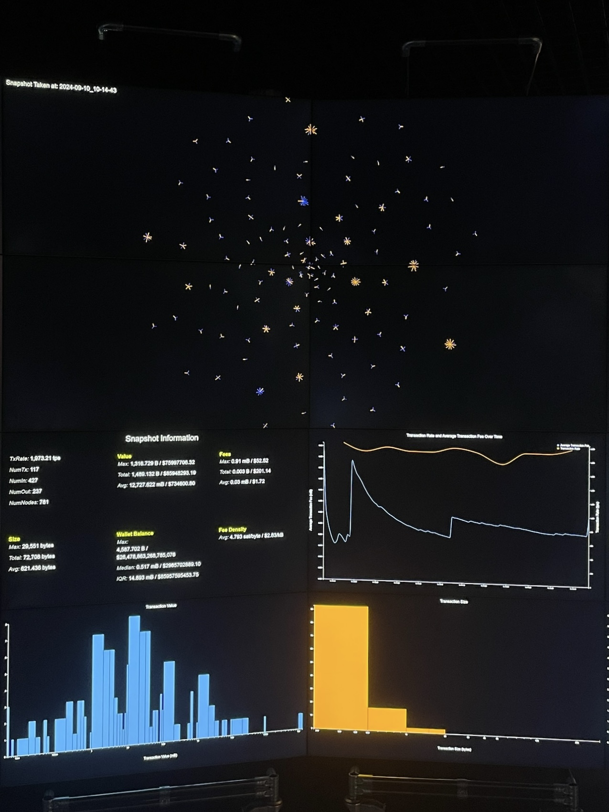
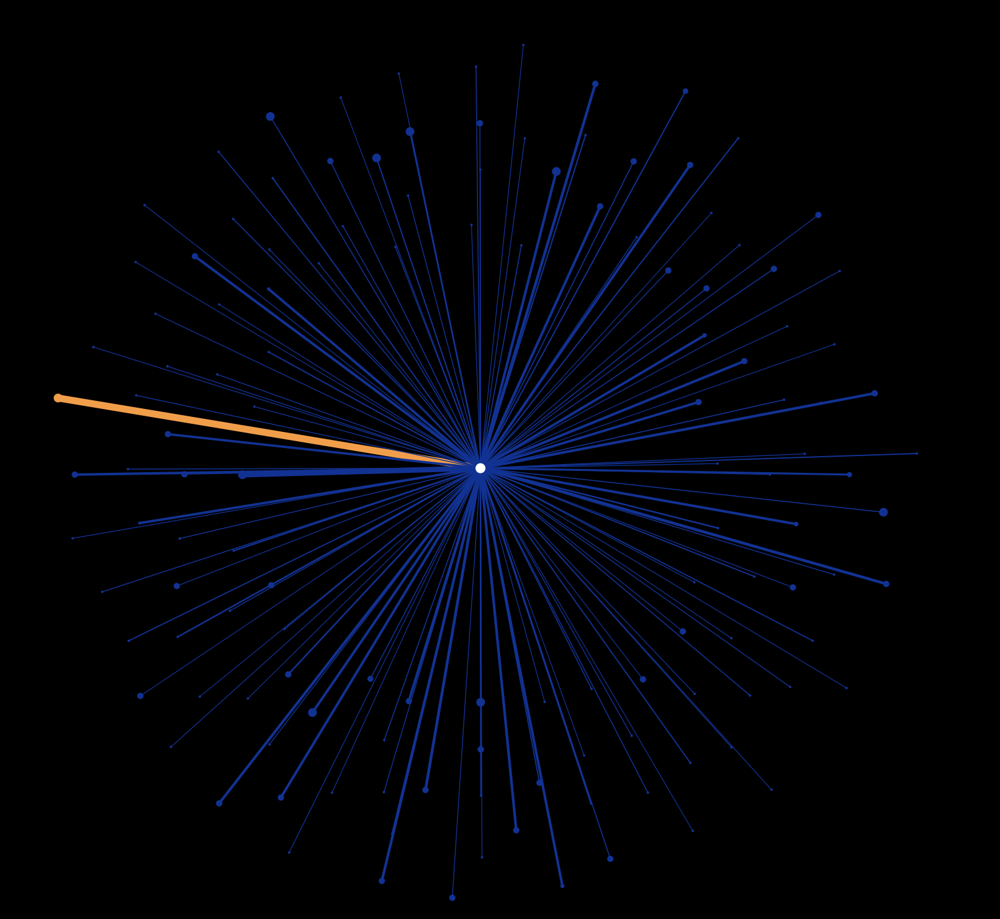
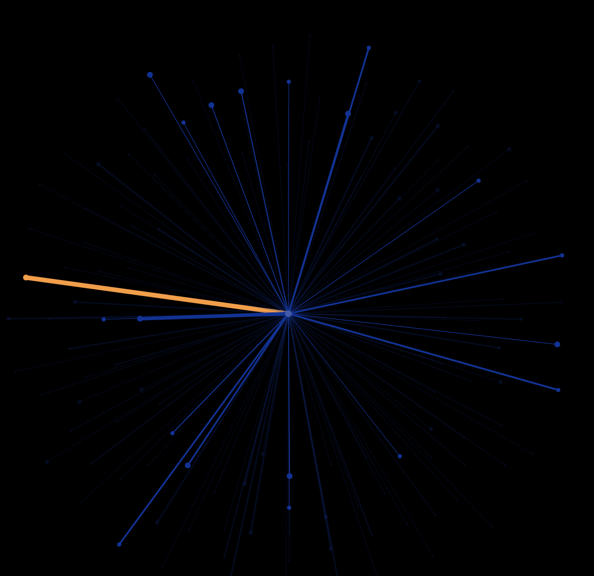
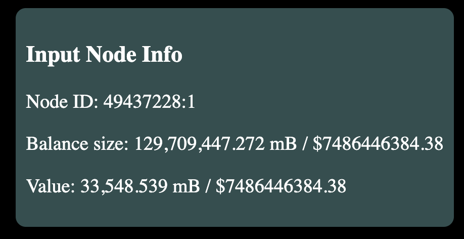
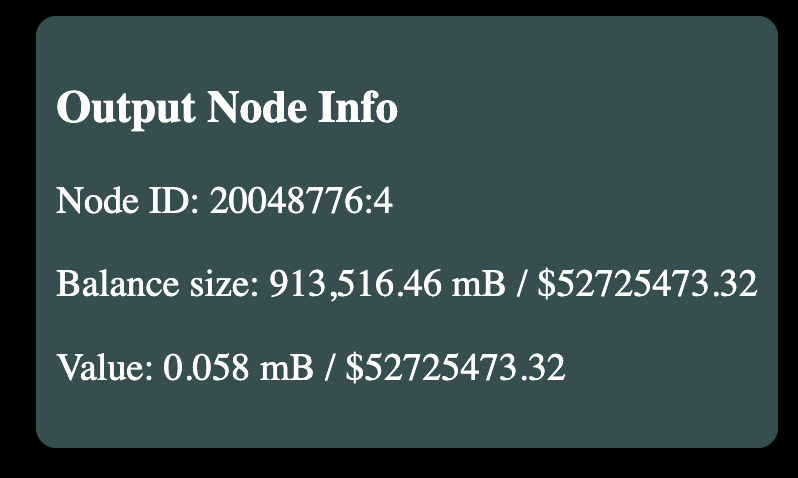
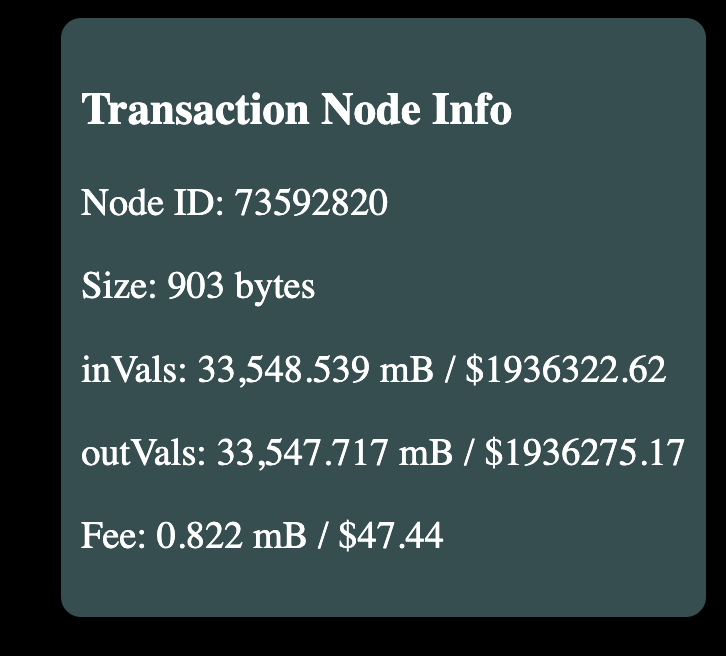

# Crypto Explorer

**Crypto Explorer** is a real-time Bitcoin data visualization tool developed for the **Data Observatory at Imperial College London**. Built on an existing demo created by a former MSc Computing student, Crypto Explorer retains the original functionality of visualizing Bitcoin transactions in a force-directed graph. It enhances this foundation with additional features, improved performance, and distributed rendering across multiple clients.

---

## Features

### **Distributed Rendering**  
Crypto Explorer distributes the rendering of the visualization across multiple clients, where each client represents a **screen or web tab**. Each client is assigned a portion of the graph to render based on a **row-column system**, ensuring efficient and scalable performance.  

### **Dynamic Data-Driven Visualization**  
Transaction values and wallet balances are dynamically visualized, with **edge thickness** representing transaction sizes and **node size** reflecting wallet balances. This provides clear and intuitive insights into Bitcoin transactions.  

<table>
  <tr>
    <td></td>
    <td></td>
  </tr>
</table>

### **Statistical Data Visualizations**  
Real-time statistical graphs, including **histograms** and **line charts**, dynamically display transaction metrics. These visualizations make it easier to identify patterns and anomalies in real-time.  

<table>
  <tr>
    <td></td>
    <td></td>
  </tr>
  <tr>
    <td></td>
    <td></td>
  </tr>
</table>

### **Historical Data Comparison**  
Users can save snapshots of the current graph and statistical measures, then compare multiple snapshots side-by-side to analyze historical trends. Users can select which snapshots to view using the controller. Below are examples showing the controller interface and how a snapshot view appears on the observatory screens.

### **Enhanced Interactivity**  
Crypto Explorer allows users to:
- Apply **filters** to focus on specific transactions. When a filter is applied, nodes and edges that do not meet the criteria are displayed with lower opacity. Below is an example showing the visualization before and after applying a filter on balance size.

<table>
  <tr>
    <td></td>
    <td></td>
  </tr>
</table>

- View detailed information for selected transactions.

<table>
  <tr>
    <td></td>
    <td></td>
    <td></td>
  </tr>
</table>

---

## Technologies Used

- **Python**:
  - Retrieves real-time Bitcoin data and processes it to compute graph layouts using the ForceAtlas2 algorithm.
- **JavaScript**:
  - Visualization rendering implemented using **D3.js**.
- **Socket.IO**:
  - Facilitates real-time communication between the server and clients.

---

## How It Works

1. **Data Processing**:  
   - The server retrieves real-time Bitcoin transaction data from **Blockchain.com's WebSocket API**.
   - Transactions are processed and added to a **global graph**, which maintains the entire visualization dataset.

2. **Server-to-Client Communication**:  
   - The server broadcasts the entire graph dataset to all connected clients using **Socket.IO**.
   - Each client represents a **screen or web tab** and is assigned a specific portion of the graph to render based on its **row-column position**.

3. **Client Rendering**:  
   - Clients filter the graph data they receive to extract only the nodes and edges within their assigned portion, determined by their row and column parameters.
   - Using **D3.js**, clients render their portion of the graph, ensuring the visualization spans multiple screens seamlessly.

4. **Continuous Updates**:  
   - The server periodically updates the graph as new transactions are processed.
   - Updated graph data is sent to the clients, ensuring real-time changes are reflected dynamically.

---

## Note

The system was designed specifically for use in the **Data Observatory** environment. As such:  
- The full real-time visualization demo may not display properly on a standard desktop setup due to its distributed rendering design.  
- While the controller interface can be accessed in a separate browser tab, the snapshot viewing functionalities rely on API calls to the observatory, which will not function outside the observatory setup.  

